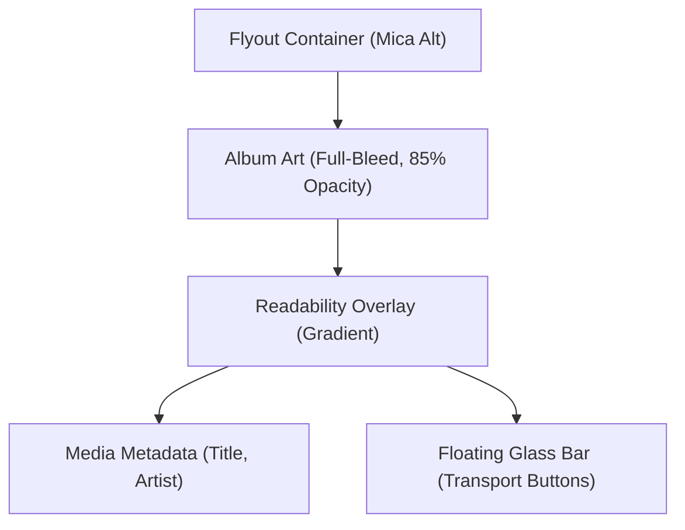

# Component Spec: ImmersiveMediaSession

## 1. Overview

The `ImmersiveMediaSession` is a modernized version of `SessionControl` that treats the active media album art as the primary immersive background.

## 2. Visual Structure

### 2.1 Background Layer (The "Art")

- **Source**: `ImageSource` from `Thumbnail`.
- **Stretch**: `UniformToFill`.
- **Opacity**: Configurable via `ImmersiveBackgroundOpacity` (default: `50%`).
- **Processing**: No radial masks. Edge-to-edge content with `BlurEffect Radius=30`.
- **Overlay**: Bottom-weighted `LinearGradientBrush` (`#60000000` at bottom, `#10000000` at top) to protect transport control visibility.

### 2.2 Content Layer (The "Info")

- **Typography**:
  - Title: Segoe UI Variable Display, 14pt, Semibold.
  - Artist: Segoe UI Variable Text, 11pt, Normal.
- **App Icon**: Tiny icon (16px) floating next to the App Name.

### 2.3 Controls Layer (The "Interactions")

- **Bar**: A floating "Glass" bar (`Acrylic` or high-blur `Glassmorphism`) containing transport buttons.
- **Buttons**: Glyph-only buttons with high contrast backgrounds on hover.

## 3. Layout Schema (Mermaid)

## 4. Technical Constraints

- Must fallback to simple `FlyoutBackground` if `UseGSMTCThumbnailAsBackground` is FALSE.
- Must preserve accessibility (contrast ratio > 4.5:1 for text).
- Forces dark theme on `SessionControl` when immersive mode is active for consistent contrast.

---

> This documentation is part of the [ModernFlyouts](https://github.com/ModernFlyouts-Community/ModernFlyouts) project, licensed under the [MIT License](../../LICENSE). Original Copyright (c) 2020 Shankar.
